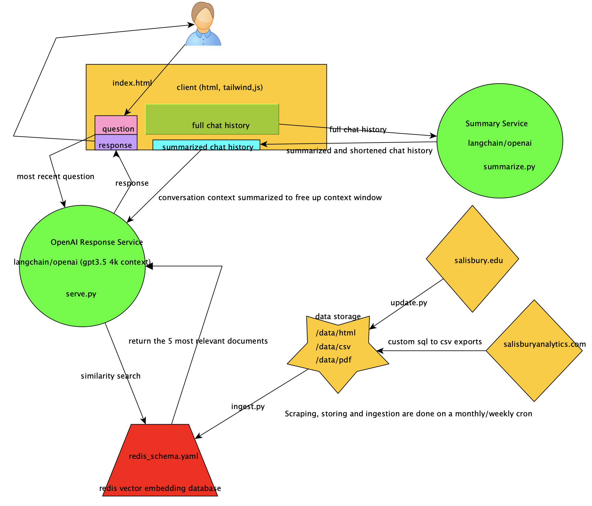
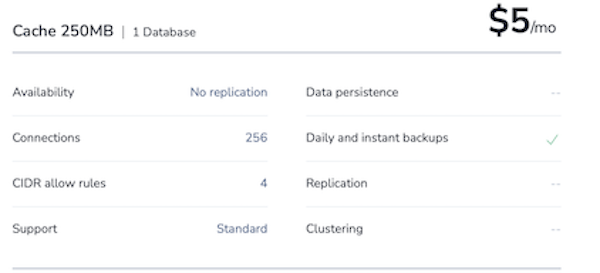
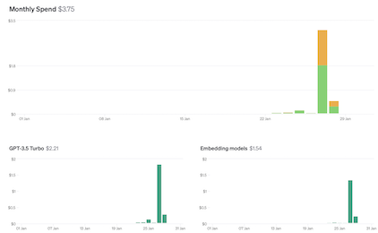

# Project Outline
[github link](https://github.com/idugan100/gullGPT)
## TEAM#58 (gullGPT)
- Brian Bowers, Salsibury University, bbowers4@gulls.salibsury.edu
- Isaac Dugan, Salisbury University, isaacd4444@gmail.com
- Mikey Montebell, Salisbury Univeristy, jamesmontebell4@gmail.com 
## Name of Institution Solution Serves
- Salisbury University
## Live Link
[gullgpt.study](http://gullgpt.study)
## Diagram of Product Architecture

## Cost
- $5 per month redis cloud instance to store vector embeddings
    - 
- $5 per month linux vm, for document storage and running ETL scripts and langchain hosting
    - 
- $3.75 in openAI credits over the weekend (has switched to using azure open ai in production)
    - 
## DEMO VIDEO
- Isaac might do this?
## Tech
- Python
- Redis (hosted on azure via redis cloud)
- Langchain
- Langserve
- Javascript
- Tailwind CSS
- HTML
- Azure OpenAI
- ngnix